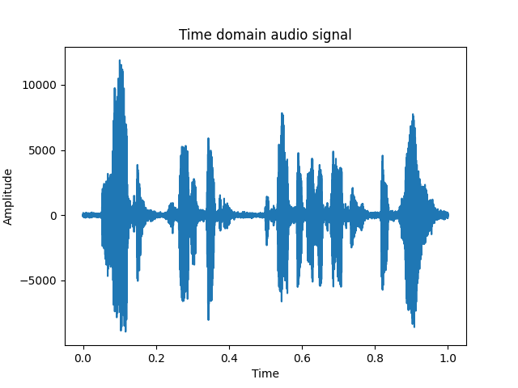
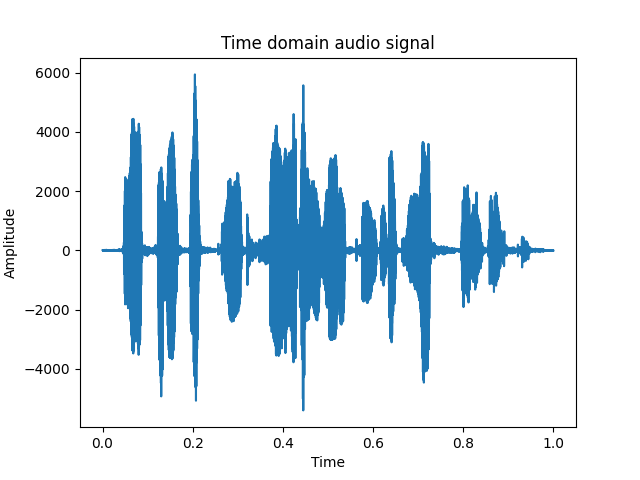
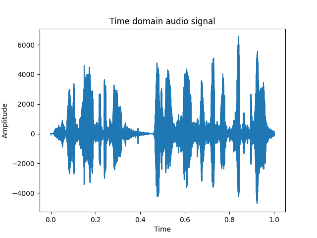
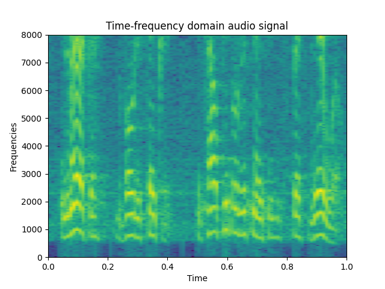
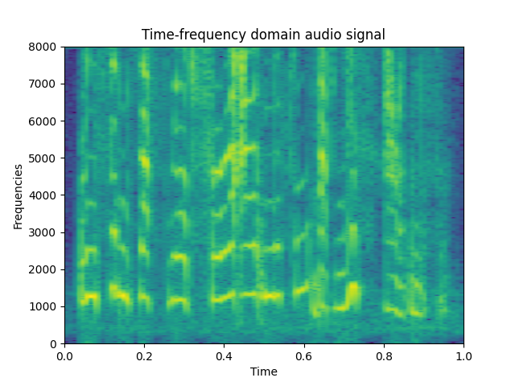
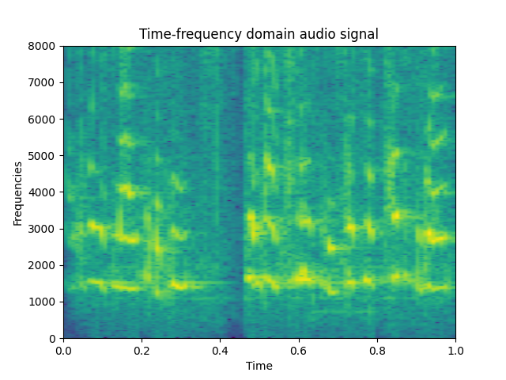

# Audio Feature Extraction
This repository contains implementations of audio feature extractions including spectrogram, mel-scale spectroram, mel-frequency cepstrum coefficients (MFCC) with numpy. Although these audio data preprocessing implementation are provided by many libraries, I wrote a code from scratch to enhance the theoritical understanding. 

## Audio Samples
In this work, three audio samples taken from YouTube are used. The audio is a speech from the U.S. president Joe Biden, EU commision president Ursula von der Leyen, and Swedish young activist Greta Thunberg.

Each audio signal looks like below.
#### Joe Biden


#### Ursula von der Leyen


#### Greta Thunberg



## Features
### Spectrogram
The spectrogram is a time-frequency domain speech features. The spectorgram contains time, frequency and amplitude information of an audio signal. \
Extracted spectrogram looks like below.
#### Biden


#### Ursula von der Leyen


#### Greta Thunberg


### Mel-scale Spectrogram
The mel-scale spectrogram is a spectrogram in mel-scale (imitation of human auditory perception scale). Each spectrum is wrapped with mel-scale filter banks. As a result, the dimension is significantly reduced.

### MFCC
MFCC is the features containing the spectrum contor over time. As it is onle spectrum envelope, the dimension is more reduced compared to mel-scale spectrogram.

## How to extract features

#### Requirement
You need to have `numpy` and `scipy` installed at your environment.

#### Run the following command inside of the directory 
```
python feature_extraction --audio_dir audio_samples --feature_type "spectrogram"
```
You can specify the direcotry cotaining audio files with `audio_dir`. `feawture_type` is a type offeature to be extracted from audio files.

#### Outputs
The image of signals and spectrograms are saved under the `plots` direcotry. If you run the above command, you will get the dimension of the specified feature. 
